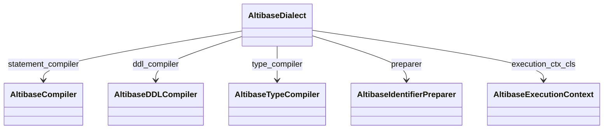

# API Reference

Reference for the public API surface in `sqlalchemy_altibase`.

## Module exports (`sqlalchemy_altibase.__init__`)

- `AltibaseDialect`
- All exported type classes: `NUMERIC`, `DECIMAL`, `FLOAT`, `REAL`, `DOUBLE`, `SMALLINT`, `INTEGER`, `BIGINT`, `SERIAL`, `VARCHAR`, `CHAR`, `NCHAR`, `NVARCHAR`, `CLOB`, `BLOB`, `DATE`, `BIT`, `VARBIT`, `BYTE`, `VARBYTE`, `NIBBLE`, `GEOMETRY`

## `AltibaseDialect`

### Core class attributes

- `name = "altibase"`
- `driver = "pyaltibase"`
- `default_paramstyle = "qmark"`
- compiler/preparer/context bindings:
  - `statement_compiler = AltibaseCompiler`
  - `ddl_compiler = AltibaseDDLCompiler`
  - `type_compiler = AltibaseTypeCompiler`
  - `preparer = AltibaseIdentifierPreparer`
  - `execution_ctx_cls = AltibaseExecutionContext`

### Important capability flags

- `supports_sequences = True`
- `supports_comments = True`
- `supports_empty_insert = False`
- `insert_returning = False`
- `update_returning = False`
- `delete_returning = False`
- `postfetch_lastrowid = True`

### Public methods

- `import_dbapi()` / `dbapi()`
- `create_connect_args(url)`
- `on_connect()`
- `get_isolation_level(dbapi_conn)`
- `get_isolation_level_values()`
- `set_isolation_level(dbapi_conn, level)`
- `reset_isolation_level(dbapi_conn)`
- `get_table_names(connection, schema=None, **kw)`
- `get_view_names(connection, schema=None, **kw)`
- `get_view_definition(connection, view_name, schema=None, **kw)`
- `get_columns(connection, table_name, schema=None, **kw)`
- `get_pk_constraint(connection, table_name, schema=None, **kw)`
- `get_foreign_keys(connection, table_name, schema=None, **kw)`
- `get_indexes(connection, table_name, schema=None, **kw)`
- `get_table_comment(connection, table_name, schema=None, **kw)`
- `get_schema_names(connection, **kw)`
- `has_table(connection, table_name, schema=None, **kw)`
- `has_index(connection, table_name, index_name, schema=None)`
- `has_sequence(connection, sequence_name, schema=None, **kw)`
- `is_disconnect(e, connection, cursor)`
- `do_ping(dbapi_connection)`

### Internal helper methods commonly relevant to contributors

- `_get_server_version_info(connection)`
- `_get_default_schema_name(connection)`
- `_effective_schema(connection, schema)`
- `_row_get(row, key, index, default=None)`
- `_resolve_column_type(data_type, data_precision, data_scale)`
- `_extract_error_code(exception)`

## `AltibaseCompiler`

Key SQL compilation methods:

- `visit_sysdate_func()` -> `SYSDATE`
- `visit_dual_func()` -> `DUAL`
- `default_from()` -> ` FROM DUAL`
- `visit_cast()`
- `render_literal_value()` (escapes backslashes)
- `get_select_precolumns()` (`DISTINCT` handling)
- `visit_join()` (`INNER JOIN` / `LEFT OUTER JOIN`)
- `for_update_clause()` (`FOR UPDATE`, `OF`, `WAIT`, `NOWAIT`)
- `limit_clause()` (Altibase 1-based `OFFSET` adjustment via `offset + 1`)

## `AltibaseDDLCompiler`

- `get_column_specification()`
- `post_create_table()`
- `visit_set_table_comment()`
- `visit_drop_table_comment()`
- `visit_set_column_comment()`

Autoincrement columns are compiled as `INTEGER DEFAULT <seq>.NEXTVAL`.

## `AltibaseTypeCompiler`

Implements visit methods for numeric, string, LOB, binary, and Altibase-specific types:

- `visit_BOOLEAN`
- `visit_NUMERIC`, `visit_DECIMAL`, `visit_FLOAT`, `visit_REAL`, `visit_DOUBLE`
- `visit_SMALLINT`, `visit_INTEGER`, `visit_BIGINT`, `visit_SERIAL`
- `visit_VARCHAR`, `visit_CHAR`, `visit_NCHAR`, `visit_NVARCHAR`
- `visit_CLOB`, `visit_BLOB`, `visit_DATE`
- `visit_BIT`, `visit_VARBIT`, `visit_BYTE`, `visit_VARBYTE`, `visit_NIBBLE`, `visit_GEOMETRY`
- fallback affinities: `visit_large_binary`, `visit_text`, `visit_datetime`

## `AltibaseIdentifierPreparer`

- Inherits SQLAlchemy `IdentifierPreparer`
- Uses Altibase reserved words set (`RESERVED_WORDS`)
- Helper: `_quote_free_identifiers(*ids)`

## `AltibaseExecutionContext`

- `should_autocommit_text(statement)` using `AUTOCOMMIT_REGEXP`
- `get_lastrowid()`:
  1. returns `cursor.lastrowid` if available
  2. otherwise attempts sequence `CURRVAL` lookup for autoincrement table inserts

## Types API

Public type classes in `sqlalchemy_altibase.types`:

- `NUMERIC`, `DECIMAL`, `FLOAT`, `REAL`, `DOUBLE`
- `SMALLINT`, `INTEGER`, `BIGINT`, `SERIAL`
- `VARCHAR`, `CHAR`, `NCHAR`, `NVARCHAR`
- `CLOB`, `BLOB`, `DATE`
- `BIT`, `VARBIT`, `BYTE`, `VARBYTE`, `NIBBLE`, `GEOMETRY`

## Event listeners and helpers

- `autoinc_seq_name(table_name, column_name)`
- `_get_autoinc_column(table)`
- `@event.listens_for(sa.Table, "before_create")` -> `_create_implicit_sequences`
- `@event.listens_for(sa.Table, "after_drop")` -> `_drop_implicit_sequences`

## Class relationships

