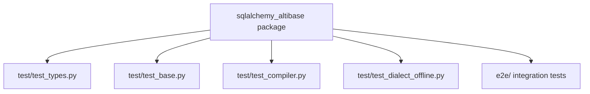

# Development Guide

This project contains the SQLAlchemy Altibase dialect package (`sqlalchemy_altibase`) plus unit and e2e tests.

## Clone and setup

```bash
git clone https://github.com/yeongseon/sqlalchemy-pyaltibase.git
cd sqlalchemy-pyaltibase
python -m venv .venv
source .venv/bin/activate
```

Install development dependencies from `pyproject.toml`:

```bash
pip install -e .
pip install -e ".[dev]"
```

Optional DB-API extra:

```bash
pip install -e ".[pyaltibase]"
```

## Running tests

```bash
pytest
```

Targeted runs:

```bash
pytest test/test_types.py
pytest test/test_base.py
pytest test/test_compiler.py
pytest test/test_dialect_offline.py
```

## Test structure

- `test/test_types.py`: custom type classes and repr/bind behavior
- `test/test_base.py`: identifier preparer, execution context, autocommit regex
- `test/test_compiler.py`: SQL/DDL/type compilation behavior (including offset adjustment)
- `test/test_dialect_offline.py`: dialect flags, connect args, reflection, disconnect detection, event listeners
- `e2e/`: integration-oriented tests



## Lint and style

Ruff is configured in `pyproject.toml`:

- line length: 100
- target version: py310

Run linting:

```bash
ruff check .
```

## Coverage configuration

- Coverage source: `sqlalchemy_altibase`
- `fail_under = 95`
