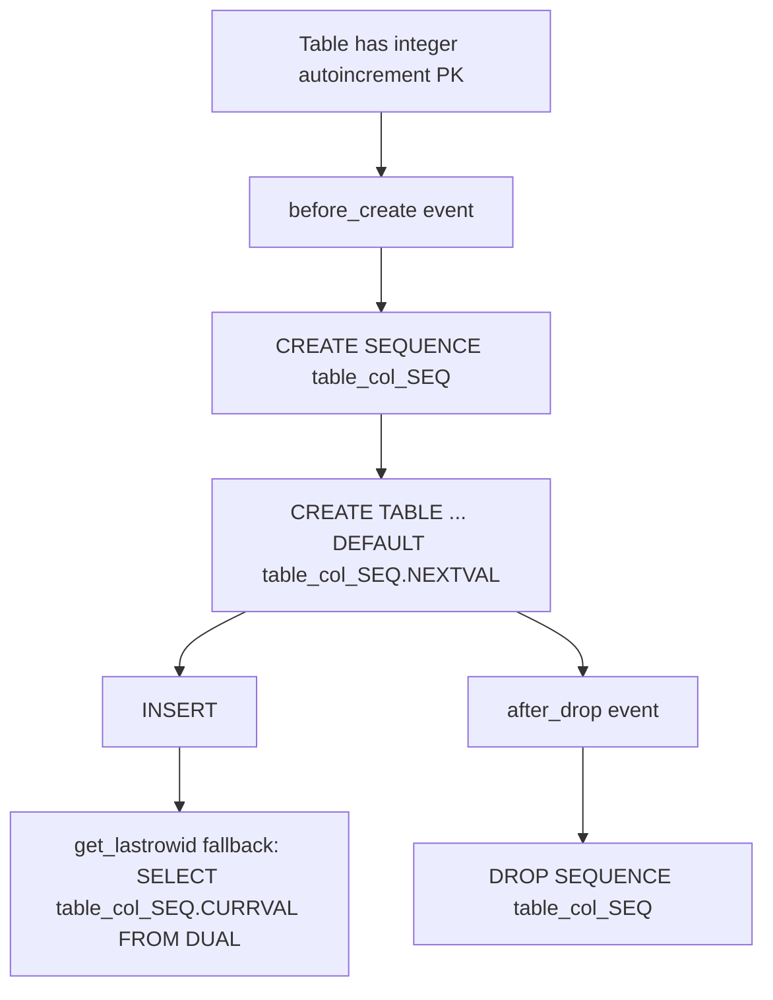

# Dialect Features

This dialect (`AltibaseDialect`) includes several Altibase-specific behaviors that are important to understand.

## Core capabilities

- Dialect name: `altibase`
- Driver name: `pyaltibase`
- SQLAlchemy paramstyle: `qmark`
- Sequence support enabled (`supports_sequences=True`)
- Comments supported (`supports_comments=True`)
- `RETURNING` is disabled for INSERT/UPDATE/DELETE
- `postfetch_lastrowid=True`

## Autoincrement via implicit sequences

Altibase autoincrement for integer PK columns is implemented by sequence orchestration, not native identity syntax.

### How it works

1. `autoinc_seq_name(table, column)` builds `<table>_<column>_SEQ`.
2. `before_create` table event creates sequence:
   - `CREATE SEQUENCE <seq> START WITH 1 INCREMENT BY 1`
3. DDL compiler emits autoincrement column as:
   - `INTEGER DEFAULT <seq>.NEXTVAL`
4. `after_drop` table event attempts to drop sequence.
5. Execution context may fetch `CURRVAL` from the sequence for `lastrowid` fallback.



!!! warning "Behavior difference"
    If your workflow bypasses SQLAlchemy table create/drop events, the implicit sequence may not be created or dropped automatically.

## Isolation levels

Supported isolation levels:

- `READ COMMITTED`
- `REPEATABLE READ`
- `SERIALIZABLE`

`set_isolation_level()` validates against this list and executes:

```sql
SET TRANSACTION ISOLATION LEVEL <LEVEL>
```

## 1-based OFFSET normalization

Altibase `OFFSET` is 1-based, while SQLAlchemy offset semantics are 0-based.

The statement compiler always emits `(offset + 1)`:

- `.offset(0)` -> `OFFSET (0 + 1)`
- `.offset(5)` -> `OFFSET (5 + 1)`

Offset-only queries are rewritten as:

```sql
LIMIT 9223372036854775807 OFFSET (n + 1)
```

```mermaid
flowchart LR
    SA[SQLAlchemy offset: n\n0-based] --> C[AltibaseCompiler.limit_clause]
    C --> A[Emit OFFSET (n + 1)\n1-based Altibase]
    C --> B[If no limit: LIMIT 9223372036854775807]
```

## Identity and sequence handling

- Dialect uses explicit sequence names for autoincrement integer keys.
- `has_sequence()` checks `SYSTEM_.SYS_SEQUENCES_`.
- `supports_sequences=True`, `sequences_optional=True`.

!!! note "Server default disables implicit autoincrement sequence logic"
    If the autoincrement column already has `server_default`, implicit sequence management is skipped.
