# Type Mapping

`sqlalchemy_altibase.types` provides Altibase-aware SQLAlchemy type classes and compiler mappings.

## Type families

```mermaid
classDiagram
    class sqltypes_NUMERIC
    class sqltypes_FLOAT
    class sqltypes_INTEGER
    class sqltypes_String
    class sqltypes_Text
    class sqltypes_LargeBinary
    class sqltypes_DATE
    class sqltypes_TypeEngine

    class NUMERIC
    class DECIMAL
    class FLOAT
    class REAL
    class DOUBLE
    class SMALLINT
    class INTEGER
    class BIGINT
    class SERIAL
    class VARCHAR
    class CHAR
    class NCHAR
    class NVARCHAR
    class CLOB
    class BLOB
    class DATE
    class BIT
    class VARBIT
    class BYTE
    class VARBYTE
    class NIBBLE
    class GEOMETRY

    sqltypes_NUMERIC <|-- NUMERIC
    sqltypes_NUMERIC <|-- DECIMAL
    sqltypes_FLOAT <|-- FLOAT
    sqltypes_FLOAT <|-- REAL
    sqltypes_FLOAT <|-- DOUBLE
    sqltypes_INTEGER <|-- SMALLINT
    sqltypes_INTEGER <|-- INTEGER
    sqltypes_INTEGER <|-- BIGINT
    sqltypes_INTEGER <|-- SERIAL
    sqltypes_String <|-- VARCHAR
    sqltypes_String <|-- CHAR
    sqltypes_String <|-- NCHAR
    sqltypes_String <|-- NVARCHAR
    sqltypes_Text <|-- CLOB
    sqltypes_LargeBinary <|-- BLOB
    sqltypes_DATE <|-- DATE
    sqltypes_TypeEngine <|-- BIT
    sqltypes_TypeEngine <|-- VARBIT
    sqltypes_LargeBinary <|-- BYTE
    sqltypes_LargeBinary <|-- VARBYTE
    sqltypes_TypeEngine <|-- NIBBLE
    sqltypes_TypeEngine <|-- GEOMETRY
```

## Complete type list (22 classes)

### Numeric

- `NUMERIC(precision=None, scale=None)`
- `DECIMAL(precision=None, scale=None)`
- `FLOAT(precision=None)`
- `REAL()`
- `DOUBLE()`
- `SMALLINT()`
- `INTEGER()`
- `BIGINT()`
- `SERIAL()`

### Character / text

- `VARCHAR(length=None)`
- `CHAR(length=None)`
- `NCHAR(length=None)`
- `NVARCHAR(length=None)`
- `CLOB()`

### Binary / bit / other Altibase-specific

- `BLOB()`
- `DATE()`
- `BIT(length=None)`
- `VARBIT(length=None)`
- `BYTE(length=None)`
- `VARBYTE(length=None)`
- `NIBBLE(length=None)`
- `GEOMETRY()`

!!! note "Unique Altibase-oriented types"
    `SERIAL`, `BIT`, `VARBIT`, `BYTE`, `VARBYTE`, `NIBBLE`, and `GEOMETRY` are central Altibase-focused additions provided by this dialect package.

## `ischema_names` reflection mapping

The dialect maps reflected Altibase type names to SQLAlchemy type classes using `ischema_names`:

| Reflected type name | Mapped class |
|---|---|
| NUMERIC | `NUMERIC` |
| DECIMAL | `DECIMAL` |
| FLOAT | `FLOAT` |
| REAL | `REAL` |
| DOUBLE | `DOUBLE` |
| SMALLINT | `SMALLINT` |
| INTEGER | `INTEGER` |
| INT | `INTEGER` |
| BIGINT | `BIGINT` |
| SERIAL | `SERIAL` |
| VARCHAR | `VARCHAR` |
| CHAR | `CHAR` |
| NCHAR | `NCHAR` |
| NVARCHAR | `NVARCHAR` |
| CLOB | `CLOB` |
| BLOB | `BLOB` |
| DATE | `DATE` |
| BYTE | `BYTE` |
| NIBBLE | `NIBBLE` |
| BIT | `BIT` |
| VARBIT | `VARBIT` |
| VARBYTE | `VARBYTE` |
| GEOMETRY | `GEOMETRY` |

## Type compiler visit methods

`AltibaseTypeCompiler` implements explicit rendering for:

- `visit_BOOLEAN` -> `SMALLINT`
- `visit_NUMERIC`, `visit_DECIMAL`, `visit_FLOAT` (precision/scale aware)
- `visit_REAL`, `visit_DOUBLE`, `visit_SMALLINT`, `visit_INTEGER`, `visit_BIGINT`, `visit_SERIAL`
- `visit_VARCHAR`, `visit_CHAR`, `visit_NCHAR`, `visit_NVARCHAR`
- `visit_CLOB`, `visit_BLOB`, `visit_DATE`
- `visit_BIT`, `visit_VARBIT`, `visit_BYTE`, `visit_VARBYTE`, `visit_NIBBLE`, `visit_GEOMETRY`
- `visit_large_binary` -> `BLOB`
- `visit_text` -> `CLOB`
- `visit_datetime` -> `DATE`

## Altibase <-> SQLAlchemy <-> Python mapping

| Altibase Type | SQLAlchemy Type Class (dialect package) | Typical Python value |
|---|---|---|
| NUMERIC(p,s) | `NUMERIC` | `decimal.Decimal` |
| DECIMAL(p,s) | `DECIMAL` | `decimal.Decimal` |
| FLOAT(p) | `FLOAT` | `float` |
| REAL | `REAL` | `float` |
| DOUBLE | `DOUBLE` | `float` |
| SMALLINT | `SMALLINT` | `int` |
| INTEGER | `INTEGER` | `int` |
| BIGINT | `BIGINT` | `int` |
| SERIAL | `SERIAL` | `int` |
| VARCHAR(n) | `VARCHAR` | `str` |
| CHAR(n) | `CHAR` | `str` |
| NCHAR(n) | `NCHAR` | `str` |
| NVARCHAR(n) | `NVARCHAR` | `str` |
| CLOB | `CLOB` | `str` |
| BLOB | `BLOB` | `bytes` |
| DATE | `DATE` | `datetime.date` / datetime values from driver |
| BIT(n) | `BIT` | driver-specific bit representation |
| VARBIT(n) | `VARBIT` | driver-specific bit representation |
| BYTE(n) | `BYTE` | `bytes` |
| VARBYTE(n) | `VARBYTE` | `bytes` |
| NIBBLE(n) | `NIBBLE` | driver-specific representation |
| GEOMETRY | `GEOMETRY` | driver-specific geometry object/bytes |

!!! warning "Driver-level value representation"
    For `BIT`, `VARBIT`, `NIBBLE`, and `GEOMETRY`, exact Python runtime representation depends on `pyaltibase` behavior.
